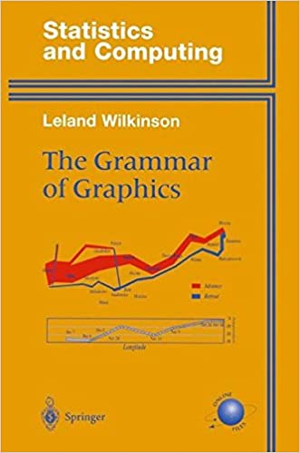
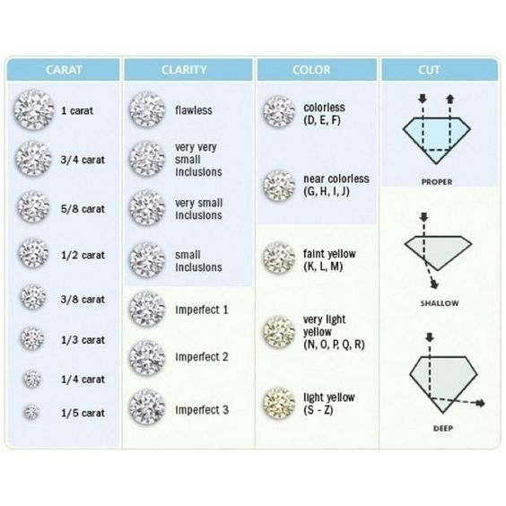

```{r set-up, echo = F}
knitr::opts_chunk$set(warning = F, 
                      message = F)

# Set dpi and height for images
knitr::opts_chunk$set(dpi = 100) 
```

```{r echo = F, warning = F, message = F}
library(tidyverse)
```

## Learning objectives

.pull-left[
- Understand basic syntax for `ggplot`

- Add aesthetics to a plot 

- Create smaller plots for subsets of data
]

.pull-right[

```{r echo = F}
ggplot(data = diamonds, aes(x = carat, y = price, color = cut)) +
  geom_point() + 
  labs(x = "Carat",
       y = "Price",
       color = "Cut",
       title = "Price vs. Carat by Cut",
       subtitle = "Faceted by Clarity") + 
  facet_wrap(~ clarity)
```
]

---

## ggplot2 in tidyverse

.pull-left[
```{r echo = F, out.width = '80%'}
knitr::include_graphics("img/ggplot2-part-of-tidyverse.png")
```
]

.pull-right[
- .vocab[ggplot2] is tidyverse's data visualization package

- The **`gg`** in "ggplot2" stands for Grammar of Graphics

- It is inspired by the book **Grammar of Graphics** by Leland Wilkinson

```{r echo = F, eval = F, out.width = "35%", fig.align = "center"}

```

]
---

## Grammar of Graphics

A .vocab[grammar of graphics] is a tool that enables us to concisely describe the components of a graphic

.center[
```{r echo = F, out.width = '80%'}
knitr::include_graphics("img/gg-layers.png")
```
]

---

## Diamonds data

.pull-left[
- We will use the **diamonds** data set in the `ggplot2` package. 

- Contains prices and other attributes of about 54,000 diamonds. 

- We'll focus on the following variables: 
    - `cut`
    - `clarity`
    - `carat`
    - `color`
    - `price`
]
  
.pull-right[

```{r echo = F}

```
]

---

## Basic `ggplot` syntax

```{r eval = F}
ggplot(data = [dataset], aes(x = [x-var], y = [y-var])) +
  geom_xx() + 
  other options
```

---

## Our first plot

.pull-left[
```{r echo = F}
ggplot(data = diamonds, aes(x = carat, y = price)) +
  geom_point() + 
  labs(x = "Carat",
       y = "Price",
       title = "Price vs. Carat")
```
]

.pull-right[
.vertical-center[
.question[
**Let's create this plot in R.**
]
]
]

---

## Plot of `price` vs. `carat`

```{r, fig.height = 4.5, fig.width = 9, fig.align = "center"}
ggplot(data = diamonds, aes(x = carat, y = price)) +
  geom_point() + 
  labs(x = "Carat",
       y = "Price",
       title = "Price vs. Carat")
```

---

## Aesthetics 

We can add .vocab[aesthetics] (features) to our plot to incoporate additional variables or to customize the plot. These aesthetics include

- `color`
- `shape`
- `size`
- `alpha` (transparency)

---

## Adding Aesthetics

.pull-left[
```{r, echo = F, fig.height = 5, fig.align = "center"}
ggplot(data = diamonds, aes(x = carat, y = price, color = cut)) +
  geom_point() + 
  labs(x = "Carat",
       y = "Price",
       title = "Price vs. Carat")
```

- Aesthetic based on value of `cut`.
- Aesthetic defined inside `aes()`.
]

.pull-right[
```{r echo = F, fig.height = 5, fig.align = "center"}
ggplot(data = diamonds, aes(x = carat, y = price)) +
  geom_point(color = "purple") + 
  labs(x = "Carat",
       y = "Price",
       title = "Price vs. Carat")
```

- Same aesthetic for all observations.
- Aesthetic defined outside of `aes()`.
]

---

class: middle, center

.question[
Let's add color and shape aesthetics to our plot. 
]

---

## Exercise 

Multiple choice question 

- Do what is wrong with this plot, where they assigned blue in the as the aesthetic. 

- Change to diamond data.

---

## Faceting

Use .vocab[faceting] to create smaller plots that display different subsets of the data.

```{r, fig.height = 5 , eval = F}
ggplot(data = diamonds, aes(x = carat, y = price)) +
  geom_point() + 
  labs(x = "Carat",
       y = "Price",
       title = "Price vs. Carat") + 
  facet_wrap(~ clarity) #<<
```

---

## Faceting by `clarity`

```{r, echo = F, fig.height = 5, fig.align = "center"}
ggplot(data = diamonds, aes(x = carat, y = price)) +
  geom_point() + 
  labs(x = "Carat",
       y = "Price",
       title = "Price vs. Carat", 
       subtitle = "Faceted by Clarity") + #<<
  facet_wrap(~ clarity) #<<
```

---

class: middle, center

.question[
Let's put it all together. Create a plot of `price` by `carat`, with an aesthetic by `cut`, faceted by `clarity`.
]


---

## Exercise


---

## Next steps


 

